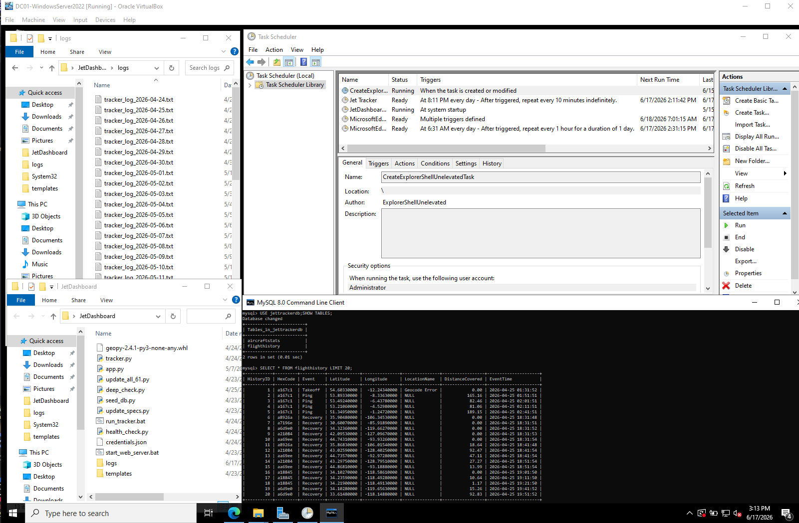
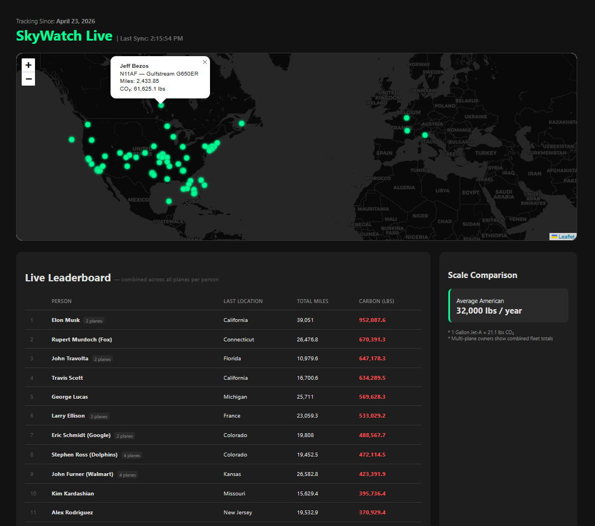

# Aviation Carbon Tracker

A real-time flight tracking and carbon emissions dashboard hosted on a self-managed Windows Server 2022 homelab environment with Active Directory integration.




---

## Overview

This project ingests live flight data from the OpenSky Network API for 61+ tracked aircraft, processes it through a Python pipeline, calculates carbon emissions in real-time, and serves an interactive map dashboard via Flask — all hosted on a Windows Server VM inside a homelab.

---

## Features

- Live flight tracking via OpenSky Network API
- Real-time carbon emissions calculation per aircraft
- Interactive map dashboard using Leaflet.js
- MySQL-backed data pipeline with automated ingestion
- Hosted on a self-managed Windows Server 2022 VM with Active Directory
- Accessible on local network via bridged networking and static IP configuration

---

## Tech Stack

| Layer | Tool |
|---|---|
| Backend | Python (Flask), MySQL |
| Frontend | JavaScript (Leaflet.js), HTML5, CSS3 |
| Infrastructure | Windows Server 2022, Active Directory, VirtualBox |
| Automation | Windows Task Scheduler |

---

## Carbon Emissions Formula

Carbon emissions are calculated in real-time using the following formula:

```
Carbon (lbs) = Distance (miles) × Fuel Burn (gal/mile) × 21.1
```

Where `21.1` is the EPA emissions factor for aviation fuel (lbs of CO₂ per gallon).

---

## Infrastructure

This is not a standard locally-run web app — it runs on a Windows Server 2022 VM in a homelab bridged networking environment, simulating a production server setup.

- **Active Directory** — Domain services configured for server and user management
- **Networking** — Static IPs and firewall rules configured to allow dashboard access across the local network from any device

---

## Local Setup

1. **Database** — Execute `sql/schema.sql` to initialize the MySQL tables
2. **Environment** — Replace placeholders in `src/` with your OpenSky API and database credentials
3. **Seed Data** — Run `python src/update_planes.py` to populate the fleet registry
4. **Launch** — Run `python src/app.py` and navigate to `localhost:5000`

---

## License

MIT
